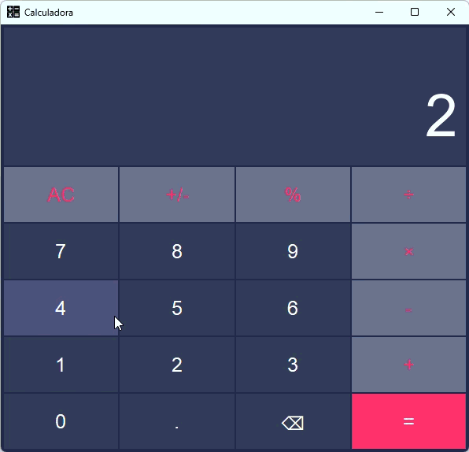

# Calculator 🧮

A Python-based GUI Calculator built with PyQt5. Features a dynamic/responsive layout, basic arithmetic operations, and error handling.

<div align="center">
  <br />
  
</div>

# Learning Goals 📖

Project aimed at practicing Python fundamentals, as well as **Graphical User Interfaces (GUI)**, **Object-Oriented Programming (OOP)**, **software architecture principles**, **Data Structures Manipulation**, and **Algorithmic Logic**.

# Key Features ⚡

- **Responsive GUI**: Clean interface built with PyQt5 that adapts to window resizing
- **Chained Calculations**:  Automatically updates the running total with each operator press (e.g., `10 / 2 +` displays `5 +`)
- **Error Handling**: Prevents crashes by handling division by zero
- **Standard Arithmetic**: Supports addition, subtraction, multiplication, division and percentage
- **Input Controls**: Includes All Clear (AC), Backspace (Delete), and Sign Toggling (+/-)
- **OOP Architecture**: Modular code structure using Classes for better maintainability

# Folder structure 📂
```
Calculadora/
├── .venv/
├── assets/
│    ├── calcpresentation.gif
│    └── calc.png
├── src/
│    ├── __init__.py
│    ├── calculadora.py
│    └── main.py
├── .gitignore
├── README.md
└── requirements.txt
```

# How to run the project 🚀
Follow these instructions to run

### Requirements

You need to have the following tools installed on your computer:
- [Python 3.x](https://www.python.org/)
- [Git](https://git-scm.com/)
- [VSCode](https://code.visualstudio.com/)

### Intallation & Run💻
```
# Clone the repository
$ git clone <repo>


# Access the project folder 
$ cd calculadora


# Create and Activate Virtual Environment 

# Windows
$ python -m venv .venv
$ .venv\Scripts\activate

# Linux/Mac
$ python3 -m venv .venv
$ source .venv/bin/activate


# Install dependencies 
$ pip install -r requirements.txt


# Run the application
$ python src/main.py
```

# Built With 🛠️
- [Python](https://www.python.org/)
- [PyQt5](https://pypi.org/project/PyQt5/)
- [PyCharm](https://www.jetbrains.com/pycharm/)

# Author ✍🏻
Developed by [Luis Otávio](https://www.linkedin.com/in/luisotavio2905/)🧑🏻‍💻
